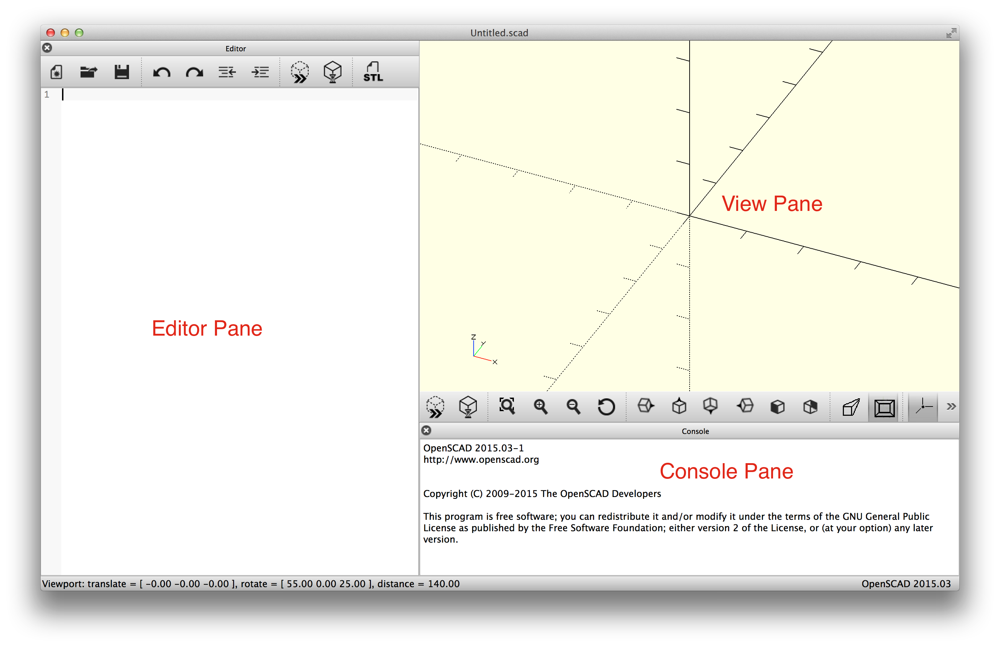
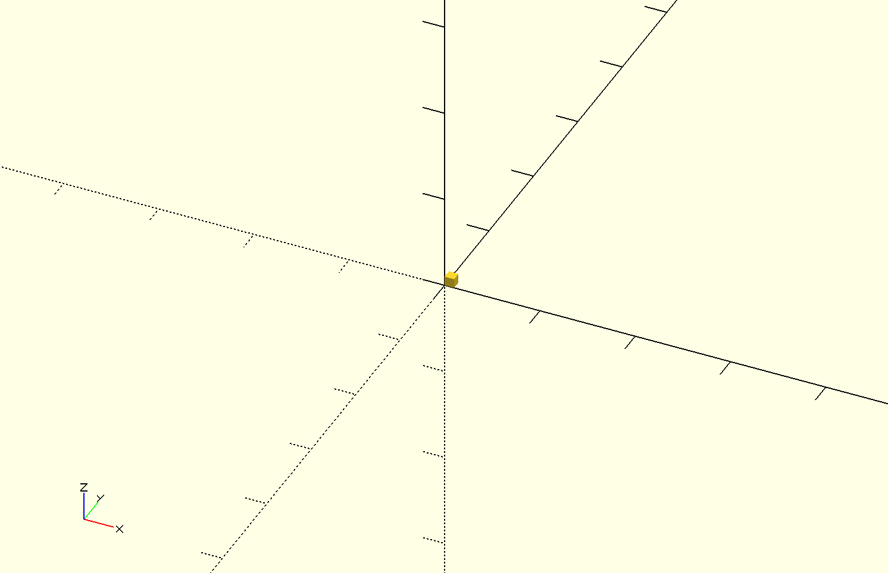
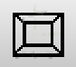

# OpenSCAD Class Handout

## Installing OpenSCAD

The latest release of OpenSCAD, as of this writing, is 2015.03-1. Download OpenSCAD from the OpenSCAD web site, http://www.openscad.org/downloads.html. There are installers for Windows, a DMG for OS X, and instructions for various Linux distributions.

## First Steps

When you start OpenSCAD a window will appear with three panes, an editor for modifying your OpenSCAD script, a view to display your 3D model, and a console for information and error messages.

## Your First Model

In the editor window, enter this (very small) script and press F5 to render the object in the view pane. You can instead press the preview button
, which is the same as pressing F5, or use the menu option Design > Preview. After you have saved the file once, updating the preview is automatic as soon as the file is saved.

    cube();

You should then see a small cube shown in the view:

## Manipulating the View

The cube is 1&times;1&times;1, which is quite small. Zoom the view using the zoom button
, or press the *zoom all* button
 to scale the view to match the size of your model. You can also use the mouse wheel or a zoom gesture on your touchpad. All of the commands that affect the view are in the View menu as well.

Clicking and dragging in the view rotates the axes around so you can see all sides of your model. By default the origin is in the center of the view, and the view rotates around the origin. You can drag the origin in the view by Ctrl-click and drag. After that the view rotates around the center of the view, rather than the origin. There are also buttons below the view panel for choosing particular eye positions, such as top, right, and so on.

## Perspective and Orthogonal Projections

By default the view shows a *perspective* projection. That is, a 2-dimensional view of the 3D scene in which objects in the view seem smaller as they recede away. To see this, zoom the view so that the cube takes up much of the area of the pane. Notice that the edges of the cube converge toward a vanishing point.

A perspective view is not always the best, because it makes it more difficult to determine whether object edges coincide. An alternative view is an *orthogonal* view, which can be selected via the menu by View > Orthogonal or by pressing the  button.
